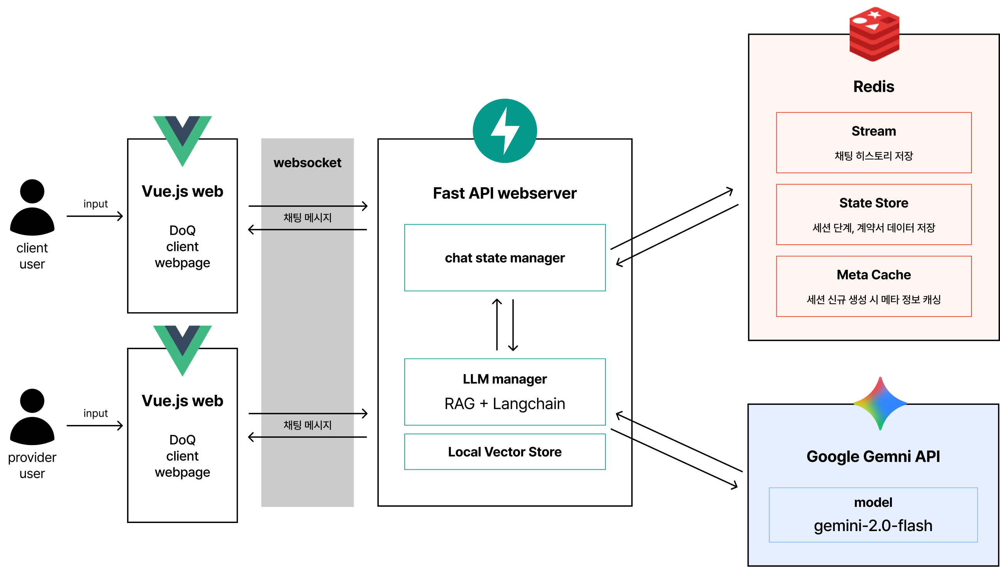

<!-- Improved compatibility of back to top link: See: https://github.com/othneildrew/Best-README-Template/pull/73 -->

<!--
*** Thanks for checking out the Best-README-Template. If you have a suggestion
*** that would make this better, please fork the repo and create a pull request
*** or simply open an issue with the tag "enhancement".
*** Don't forget to give the project a star!
*** Thanks again! Now go create something AMAZING! :D
-->

<!-- PROJECT SHIELDS -->
<!--
*** I'm using markdown "reference style" links for readability.
*** Reference links are enclosed in brackets [ ] instead of parentheses ( ).
*** See the bottom of this document for the declaration of the reference variables
*** for contributors-url, forks-url, etc. This is an optional, concise syntax you may use.
*** https://www.markdownguide.org/basic-syntax/#reference-style-links
-->

<!-- [![Contributors][contributors-shield]][contributors-url]
[![Forks][forks-shield]][forks-url]
[![Stargazers][stars-shield]][stars-url]
[![Issues][issues-shield]][issues-url]
[![project_license][license-shield]][license-url] -->

<!-- PROJECT LOGO -->
 

  

<h1 align="center">DoQ</h1>

  

    DoQ(도큐) - 당신의 AI 계약 파트너
     
    <a href="https://github.com/AT-Ankoko/doq-web-FE"><strong>DoQ FE</strong></a> . <a href="https://github.com/AT-Ankoko/doq-server"><strong>DoQ BE</strong></a> . <a href="https://github.com/AT-Ankoko/doq-mocksite"><strong>DoQ Mockup</strong></a>
     
  

<!-- 프로젝트 소개 -->
## 프로젝트 소개

  <a href="https://youtu.be/JgfBLpiZuZk">
    <!--  -->
  </a>
   
  <a href="https://youtu.be/JgfBLpiZuZk"><strong>홍보 영상 바로가기</strong></a>

본 프로젝트 **DoQ 도큐**는 법률 지식이 부족한 비전문가도 중계형 AI를 통해 일상 언어로 대화하며 손쉽게 법적 효럭
을 갖춘 계약서를 작성할 수 있도록 돕는 **맞춤 계약서 자동 생성 서비스**이다.

(<a href="#readme-top">back to top</a>)

## 🎯 주요기능

  <a href="https://youtu.be/JgfBLpiZuZk?si=QO_9Vj0EXpAxNcJD&t=45">
    <!--  -->
  </a>
   
  <a href="https://youtu.be/JgfBLpiZuZk?si=QO_9Vj0EXpAxNcJD&t=45"><strong>시연 영상 바로가기</strong></a>

### 서비스 주요 기능

✅  **중개형 AI 기반의 실시간 합의 도출 및 초안 설계**  
- 보수, 마감 기한 등 양측의 의견이 대립하는 지점에서 AI가 시장 평균 데이터와 프로젝트 성격을 고려한 중재안을 제안하여 합의를 유도한다. 
-  과업, 대금, 기한 등 계약에 필수적인 구성요소를 파악하고, 누락된 정보에 대해 질문하여 완결성 있는 계약 초안의 기틀을 마련한다. 

✅ **일상어 입력으로 전문 계약 조항 작성 기능**  
- “돈은 이달 말까지 지급하겠습니다.”와 같은 일상적인 합의 내용을 “제N조(대금 지급 방식): ‘갑’은 ‘을’에게 계약 금액을 202X년 X월 X일까지 지급하여야 한다”와 같은 표준 법률 문구로 치환한다.

✅ **계약서 저장 및 PDF 내보내기 기능**  
- 진행된 모든 계약 세션과 생성된 문서 이력을 저장하여, PDF 포맷으로 생성 및 출력이 가능한 형태로 제공한다.

 

### 서비스 차별점

✅  **대화형 AI 계약 자동화**  
- Vue.js 기반의 직관적 인터페이스와 FastAPI 백엔드, LLM 모델 연동을 통해, 사용자의 불명확하거나 일상적인 요구도 자동으로 법률적 조항으로 변환하는 기술을 구현했다. 

✅ **All-in-One 대화형 프로세스**  
-  정보입력, 쌍방 협의, 계약서 자동생성 및 활용까지 한 번에 처리할 수 있는 대화형 워크플로우를 제공하여 비전문가도 쉽게 계약서를 완성할 수 있도록 진입장벽을 최소화했다. 이때, 복잡한 법률 용어나 서식 대신, 자연어 대화와 안내 중심의 UX로 누구나 직관적으로 이용할 수 있다. 

✅ **실증적 검증 및 신뢰성 확보**  
- 전시 현장에서 MVP 시연을 통해 비전문가도 짧은 시간 내 법적 효력을 갖춘 계약서를 완성할 수 있음을 입증했다. 

(<a href="#readme-top">back to top</a>)

## 😎 함께한 사람들

| 이름 | 역할 | 담당 업무 |
| --- | --- | --- |
| **조은비** | **Backend & AI** | FastAPI 아키텍처 설계, Gemini 기반 AI 매니저 개발, 테스트 자동화 |
| **고예경** | **PM** | 서비스 기획, 프로젝트 일정 관리, 전시 운영 및 시나리오 설계 |
| **박서현** | **Design** | UX/UI 디자인 시스템 수립, 브랜드 아이덴티티(BI) 및 그래픽 제작 |
| **박정민** | **Frontend** | Vue.js 기반 인터페이스 구현, WebSocket 실시간 세션 동기화 |

(<a href="#readme-top">back to top</a>)

## 📚 기술 스택

DoQ 서비스는 확장성과 실시간성을 위해 **레이어드 아키텍처**와 **이벤트 구동형 구조**를 채택했다.

#### Frontend
- [![Vue.js][Vue.js-badge]][Vue-url] [![Vuetify][Vuetify-badge]][Vuetify-url]
- SPA(단일 페이지 애플리케이션) 구현 및 상태 관리

#### Backend
- [![FastAPI][FastAPI-badge]][FastAPI-url], [![Redis][Redis-badge]][Redis-url], [![WebSocket][WebSocket-badge]][WebSocket-url]
- 비동기 API 서버 및 실시간 통신

#### AI/LLM
-  
- Gemini-2.0-flash 및 LangChain 기반 RAG(Retrieval-Augmented Generation) 시스템

#### Infrastructure
- [![Redis Stream][Redis-Stream-badge]][Redis-Stream-url], State Store
- 세션 데이터 일관성 유지

(<a href="#readme-top">back to top</a>)

## 🚀 시작하기

### Prerequisites
* Python 3.10+
* Node.js 18+
* Redis Server

(<a href="#readme-top">back to top</a>)

<!-- 관련 링크 -->
## 📝 관련 링크

#### GitHub Repository
* [https://github.com/AT-Ankoko](https://github.com/AT-Ankoko) 

#### Technical Notes
* [LLM 인터페이스 설계 전략](https://wavicle.tistory.com/21)
* [시나리오 기반 테스트 자동화](https://wavicle.tistory.com/616)

(<a href="#readme-top">back to top</a>)

<!-- MARKDOWN LINKS & IMAGES -->

<!-- 실제로 사용된 뱃지 및 링크만 정의 -->
[WebSocket-badge]: https://img.shields.io/badge/WebSocket-4FC08D?style=for-the-badge&logo=websocket&logoColor=white
[WebSocket-url]: https://developer.mozilla.org/en-US/docs/Web/API/WebSockets_API
[Redis-Stream-badge]: https://img.shields.io/badge/Redis%20Stream-DC382D?style=for-the-badge&logo=redis&logoColor=white
[Redis-Stream-url]: https://redis.io/docs/data-types/streams/
[Vue.js-badge]: https://img.shields.io/badge/Vue.js-35495E?style=for-the-badge&logo=vuedotjs&logoColor=4FC08D
[Vue-url]: https://vuejs.org/
[Vuetify-badge]: https://img.shields.io/badge/Vuetify-1867C0?style=for-the-badge&logo=vuetify&logoColor=AEDDFF
[Vuetify-url]: https://vuetifyjs.com/
[FastAPI-badge]: https://img.shields.io/badge/FastAPI-005571?style=for-the-badge&logo=fastapi
[FastAPI-url]: https://fastapi.tiangolo.com/ko/
[Redis-badge]: https://img.shields.io/badge/redis-%23DD0031.svg?style=for-the-badge&logo=redis&logoColor=white
[Redis-url]: https://redis.io/

<!-- 커스텀 뱃지 (직접 URL 사용) -->
[Google Gemini-2.0-flash-badge]: https://img.shields.io/badge/Gemini--2.0--flash-4285F4?style=for-the-badge&logo=google&logoColor=white
[Google Gemini-2.0-flash-url]: https://deepmind.google/technologies/gemini/
[LangChain-badge]: https://img.shields.io/badge/LangChain-FFD700?style=for-the-badge&logo=python&logoColor=black
[LangChain-url]: https://www.langchain.com/